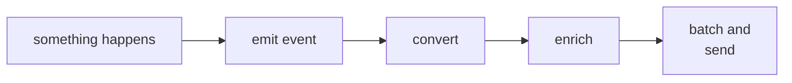
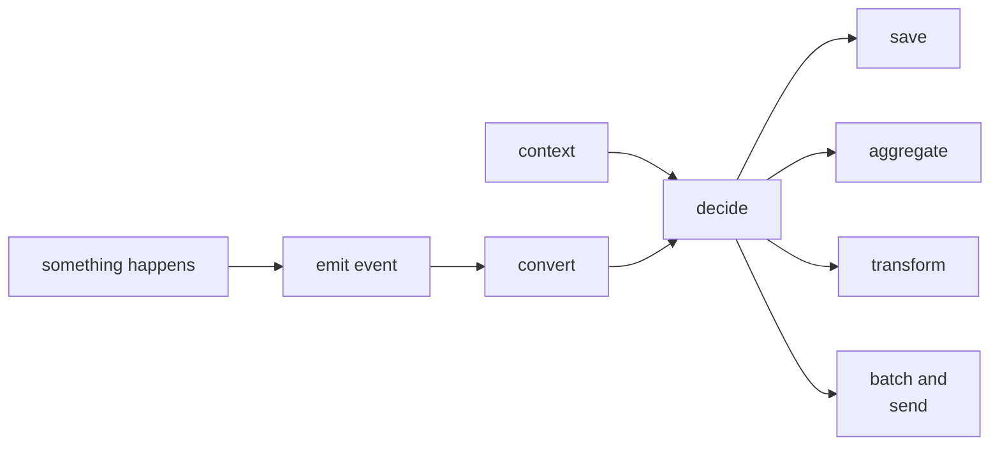

# osay

A way to wrangle mobile telemetry

There's lots of articles telling developers they're doing telemetry wrong. While that may or may not
be true for a given project, you need a way to wrangle things in the meantime without tying code
firmly to a vendor platform.

Why not use the power of all these connected computers to make smart decisions about telemetry as
the data is emitted?

Highlights
----------

* Simple api, easy connections to existing and new systems
* On-device decisions
* Hot code deploy

Architecture
------------

| Term     | Definition                                                                                                                                                                  |
|----------|-----------------------------------------------------------------------------------------------------------------------------------------------------------------------------|
| Events   | things that happen                                                                                                                                                          |
| Contexts | common data about the sender or session that one or more events may be associated with. Contexts can be attached to the all events or to only events in a specific channel. |
| Channels | places events flow to                                                                                                                                                       |
| Deciders | what should be done with events                                                                                                                                  
1. Events flow into channels -- generally one event type per channel.
2. Current context data is attached upon emission.
3. Channels are a stream of events with logic (deciders) attached to them.
4. Deciders can store, aggregate, and forward events. They can also be contacted later to trigger
   different outcomes or to update their logic.

Reasoning
---------

A typical telemetry flow creates an event, knowing at the onset how it will be delivered.  Something like:

If you have multiple destinations you would have one each of these flows backed by a different sdk, etc.  Large apps may easily have five or six.

No matter how events are defined (data class or dictionary/map), as a process of converting to the target format, events are often split to key-value pairs and pushed into JSON and similar formats. Osay events are fundamentally key-value pairs so they can be easily integrated into this flow. The intention is to provide a way to do this consistently across all events, and also provide a place for on-device thinking to occur.

TODO probably need a preprocessor and reference to channels above, revise below

You'll notice `enrich` is missing from this second flow; it warrants a bit more discussion about contextual device and session data before we bring it in.

Contextual data for events represents all the common data that every event should have.  This could include device and application data, as well as details on the active user or session.  Context should be linked with an event at the instant it is emitted -- but contexts also tend to change slowly.

This can have implications on how the data is reflected in the API and final storage; Osay doesn't require a specific approach but does try to be flexible.

TODO----

A naive (but common) context implementation would grab a snapshot of all relevant data and attach it to every event that is uploaded, even if that data is mostly or completely duplicated between them.

While Osay doesn't block such behavior, there's a better way and Osay can enable it.

Contextual data is often key-value pairs itself

Developer Guide
---------------